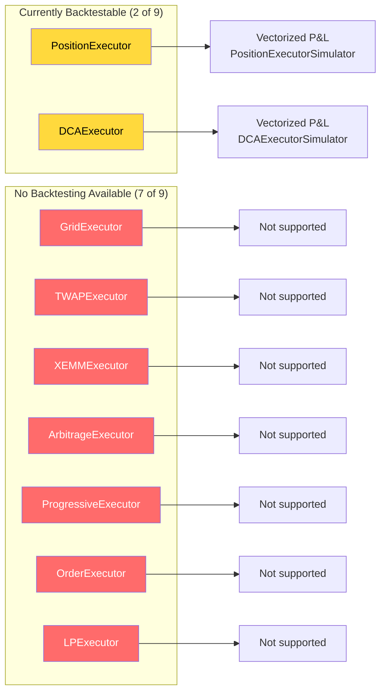
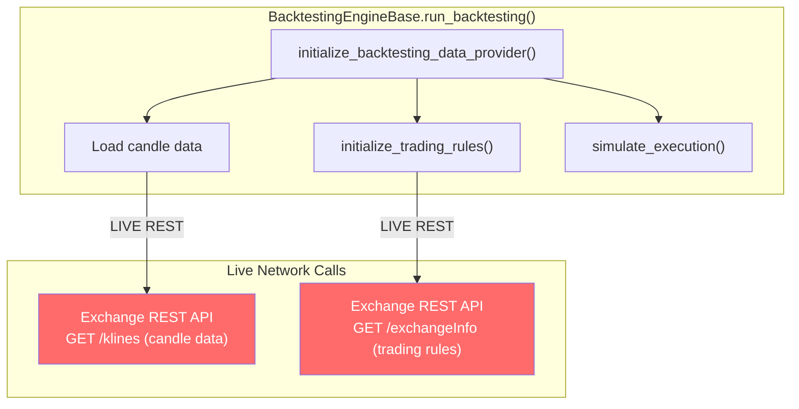
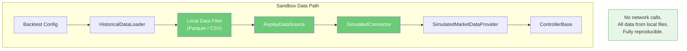
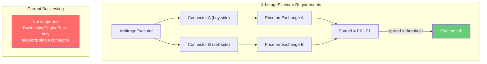
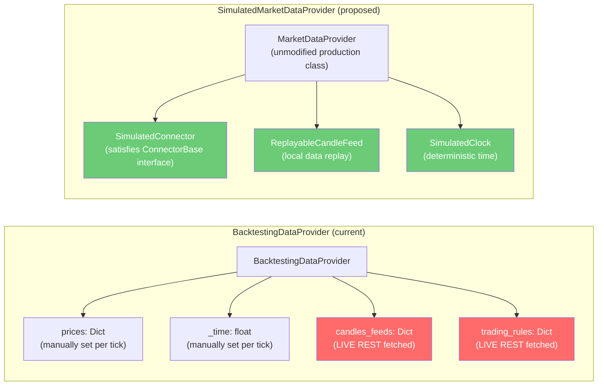

# Current Backtesting Gaps -- What Works, What Doesn't, What's Missing

This document analyzes the current `BacktestingEngineBase` system, identifies its
fundamental limitations, and maps out what the proposed sandbox approach fixes.

## 1. Current vs Proposed Architecture

The current backtesting system operates at the **controller level only**. It replays
candle data through controllers to generate executor actions, then simulates executor
outcomes using simplified vectorized math. The proposed sandbox approach runs the
**real executor code** against a `SimulatedConnector`.

```mermaid
graph TD
    subgraph "Current Backtesting (BacktestingEngineBase)"
        BE1["BacktestingEngineBase"]
        BDP1["BacktestingDataProvider"]
        PES1["PositionExecutorSimulator<br/>(vectorized P&L only)"]
        DCAS1["DCAExecutorSimulator<br/>(vectorized P&L only)"]
        Ctrl1["ControllerBase<br/>(determine_executor_actions)"]
        OHLCV1["OHLCV DataFrame<br/>(candle close prices)"]
        Exchange1["Exchange API<br/>(LIVE REST for candles!)"]

        BE1 --> BDP1
        BE1 --> PES1
        BE1 --> DCAS1
        BE1 --> Ctrl1
        Ctrl1 -->|"reads"| BDP1
        BDP1 -->|"LIVE REST call"| Exchange1
        PES1 -.->|"vectorized math"| OHLCV1
        DCAS1 -.->|"vectorized math"| OHLCV1

        style Exchange1 fill:#ff6b6b,color:#fff
        style PES1 fill:#ffd93d,color:#000
        style DCAS1 fill:#ffd93d,color:#000
    end

    subgraph "Proposed Sandbox (SimulatedConnector)"
        SE2["SandboxEngine"]
        SMDP2["SimulatedMarketDataProvider<br/>(wraps SimulatedConnector)"]
        RealExec2["Real ExecutorBase Subclasses<br/>(unmodified production code)"]
        Ctrl2["ControllerBase<br/>(unmodified)"]
        SimConn2["SimulatedConnector<br/>(events + matching + balance)"]
        Orch2["ExecutorOrchestrator<br/>(unmodified)"]
        ReplayDS2["ReplayDataSource<br/>(historical feed)"]
        LocalData2["Local Data Files<br/>(Parquet / CSV / SQLite)"]

        SE2 --> SMDP2
        SE2 --> Ctrl2
        SE2 --> Orch2
        Orch2 --> RealExec2
        RealExec2 --> SimConn2
        Ctrl2 --> SMDP2
        SMDP2 --> SimConn2
        SimConn2 --> ReplayDS2
        ReplayDS2 --> LocalData2

        style LocalData2 fill:#6bcb77,color:#fff
        style SimConn2 fill:#6bcb77,color:#fff
        style RealExec2 fill:#6bcb77,color:#fff
        style Orch2 fill:#6bcb77,color:#fff
    end
```

### Key Architectural Differences

| Aspect | Current Backtesting | Proposed Sandbox |
|--------|-------------------|-----------------|
| **Executor code** | Bypassed entirely | Runs unmodified production code |
| **Order events** | Not emitted | Full MarketEvent sequence |
| **Balance tracking** | None (infinite funds) | Full balance management with collateral |
| **Order matching** | Simplified fill logic | Matching engine against order book |
| **Partial fills** | Not supported | Full partial fill support |
| **Network dependency** | YES (live REST for candle data) | NO (all data from local files) |
| **Executor types** | 2 of 9 (Position, DCA) | All 9 executor types |
| **State machine** | Simplified (no async control loop) | Full async executor lifecycle |
| **Fees** | Flat trade_cost parameter | Per-fill fee calculation |
| **Slippage** | None (uses candle close price) | Configurable (spread, depth, impact) |
| **Deterministic** | Mostly (depends on candle fetch order) | Fully deterministic |

## 2. Executor Coverage Matrix

### Detailed Coverage Comparison

| Executor | Current Backtesting | Fidelity | With Sandbox | Fidelity |
|----------|-------------------|----------|--------------|----------|
| **PositionExecutor** | Vectorized P&L via `PositionExecutorSimulator` | LOW -- maker-only, no async loop, no events, simplified barriers | Full async control loop | HIGH -- real state machine, real events |
| **DCAExecutor** | Vectorized P&L via `DCAExecutorSimulator` | LOW -- maker-only, no async loop, no multi-level management | Full async control loop | HIGH -- real DCA level management |
| **GridExecutor** | Not supported | NONE | Full async control loop | HIGH -- real grid level placement/refill |
| **TWAPExecutor** | Not supported | NONE | Full async control loop | HIGH -- real time-sliced execution |
| **XEMMExecutor** | Not supported | NONE | Full async control loop | HIGH -- real cross-exchange hedging |
| **ArbitrageExecutor** | Not supported | NONE | Full async control loop | HIGH -- real cross-exchange arbitrage |
| **ProgressiveExecutor** | Not supported | NONE | Full async control loop | HIGH -- real progressive position building |
| **OrderExecutor** | Not supported | NONE | Full async control loop | HIGH -- real limit chaser logic |
| **LPExecutor** | Not supported | NONE | Full async control loop | HIGH -- real LP position management |

### What "Vectorized P&L" Actually Means

The current simulators (`PositionExecutorSimulator`, `DCAExecutorSimulator`) work by:

1. Taking the executor config (entry price, barriers, DCA levels)
2. Scanning the OHLCV DataFrame forward from entry time
3. Checking if high/low/close crosses stop-loss or take-profit barriers
4. Computing P&L as `(exit_price - entry_price) / entry_price - trade_cost`
5. Returning an `ExecutorSimulation` dataclass with the result

This approach:
- Ignores the executor's actual state machine and async control loop
- Assumes immediate fill at the close price (no order book interaction)
- Does not track balances or validate that fills are possible
- Cannot handle partial fills, order amendments, or retries
- Cannot model order types other than limit-maker
- Cannot model multi-connector executors (arbitrage, XEMM)

## 3. Live Dependencies in Current Backtesting

The current `BacktestingEngineBase` still makes live network calls despite being
a "backtesting" system. These calls happen during initialization and data loading.

### Specific Network Calls

| Call Site | Method | What It Fetches | Why It's a Problem |
|-----------|--------|----------------|-------------------|
| `BacktestingDataProvider.initialize_candles_feed()` | `CandlesFactory.get_candle(config)` | Historical OHLCV candles via exchange REST API | Requires network, rate-limited, non-deterministic (data may change) |
| `BacktestingDataProvider.initialize_trading_rules()` | `connector.trading_rules` (simulated fetch) | Min order size, price quantum, etc. | Requires exchange API access for rule discovery |
| Controller candle configs | `market_data_provider.initialize_candles_feed(config)` | Additional candle timeframes for signals | Same as above |

### Impact of Live Dependencies

1. **Non-reproducible results:** Candle data from exchanges may differ between runs
   (exchange data corrections, timezone issues, API version changes).

2. **Rate limiting:** Running many backtests hits exchange rate limits. Binance allows
   ~1200 requests/minute; a parameter sweep of 100 configs with 3 candle timeframes
   each = 300 REST calls per sweep.

3. **Network requirement:** Cannot run backtests offline, on CI without exchange
   access, or in environments with restricted network.

4. **Data staleness:** Backtesting always fetches from the exchange's current endpoint.
   If the exchange changes its historical data format or availability, backtests break.

### How the Sandbox Eliminates Live Dependencies

## 4. Fidelity Gap Analysis

### 4.1 Order Lifecycle Fidelity

```mermaid
graph TD
    subgraph "Real Executor Lifecycle"
        R1["Place order"] --> R2["OrderCreated event"]
        R2 --> R3["Wait for fill"]
        R3 --> R4["OrderFilled event (may be partial)"]
        R4 --> R5{"Fully filled?"}
        R5 -->|No| R3
        R5 -->|Yes| R6["OrderCompleted event"]
        R6 --> R7["Check barriers"]
        R7 --> R8["Place closing order"]
        R8 --> R9["Wait for close fill"]
        R9 --> R10["Closing OrderFilled event"]
        R10 --> R11["OrderCompleted event"]
        R11 --> R12["TERMINATED"]
    end

    subgraph "Current Backtesting Simulation"
        S1["Entry at candle close"] --> S2["Scan forward candles"]
        S2 --> S3{"SL/TP/TL hit?"}
        S3 -->|No| S2
        S3 -->|SL| S4["Exit at SL price"]
        S3 -->|TP| S5["Exit at TP price"]
        S3 -->|TL| S6["Exit at close price"]
        S4 --> S7["Compute P&L"]
        S5 --> S7
        S6 --> S7
    end

    style R1 fill:#6bcb77,color:#fff
    style R12 fill:#6bcb77,color:#fff
    style S1 fill:#ffd93d,color:#000
    style S7 fill:#ffd93d,color:#000
```

### 4.2 What's Lost in Vectorized Simulation

| Real Behavior | Current Simulation | Gap |
|--------------|-------------------|-----|
| Order may not fill (price doesn't reach limit) | Always fills at close price | Overestimates fill rate |
| Partial fills over multiple ticks | Instant full fill | Misses fill timing effects |
| Slippage on market orders | No slippage | Overestimates returns |
| Fee per fill (maker/taker rates) | Flat `trade_cost` parameter | Inaccurate fee modeling |
| Balance consumed per order | Infinite balance | Cannot detect over-allocation |
| Concurrent executor balance conflicts | No balance tracking | Cannot detect margin calls |
| Order cancellation + re-placement | Not modeled | Misses cancel/replace latency |
| Stop-loss triggered by wick then recovered | Triggered by high/low of candle | Ambiguous (could have recovered) |
| Time-in-force expiry | Not modeled | Cannot test GTC vs IOC vs FOK |
| Grid level refill after fill | Not modeled at all | Grid executor not supported |
| DCA level management | Simplified to single-level | Misses multi-level dynamics |

### 4.3 Multi-Connector Executor Gaps

ArbitrageExecutor and XEMMExecutor require **two different connectors** (e.g., buy on
Binance, sell on Kraken). The current backtesting system has no concept of multiple
exchanges.

With the sandbox approach, multiple `SimulatedConnector` instances can be created --
one per exchange -- each with their own order book, balances, and price feeds. The
`ArbitrageExecutor` and `XEMMExecutor` run unmodified against these.

## 5. BacktestingDataProvider vs SimulatedMarketDataProvider

### Key Difference

The `BacktestingDataProvider` is a **custom class** that mimics `MarketDataProvider`
with manual price/time injection. It does not satisfy the full `MarketDataProvider`
interface.

The proposed approach uses the **unmodified production `MarketDataProvider`** class.
It receives `SimulatedConnector` instances instead of real connectors. Since
`SimulatedConnector` satisfies the same interface as `ConnectorBase`, `MarketDataProvider`
works without modification.

This means any controller that works with the production `MarketDataProvider` will
automatically work in simulation -- no controller code changes needed.

## 6. Summary of Gaps and Resolutions

| Gap | Severity | Resolution |
|-----|----------|------------|
| Only 2 of 9 executors supported | CRITICAL | SimulatedConnector enables all 9 |
| No balance tracking | HIGH | SimulatedConnector includes BalanceManager |
| No event emission | HIGH | SimulatedConnector emits full MarketEvent sequence |
| Live network required | MEDIUM | Local data replay via ReplayDataSource |
| No partial fill support | MEDIUM | MatchingEngine supports configurable fill models |
| No multi-connector support | MEDIUM | Multiple SimulatedConnector instances |
| No slippage modeling | LOW | MatchingEngine with order book depth |
| Flat fee model | LOW | Per-fill fee calculation in SimulatedConnector |
| Non-deterministic data | LOW | Local data files ensure reproducibility |
| No order cancellation modeling | LOW | SimulatedConnector handles cancel flow |
