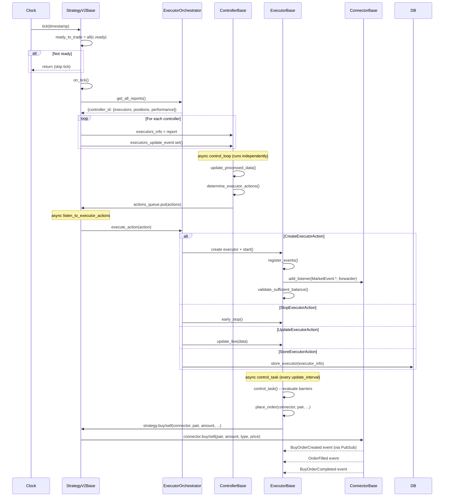
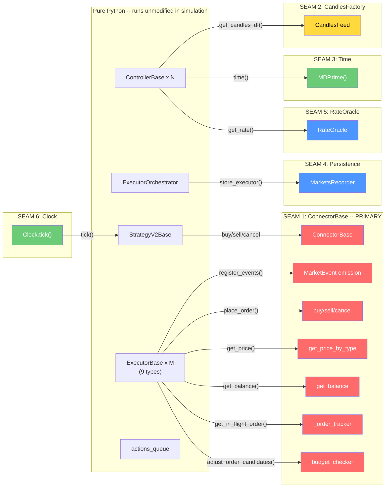
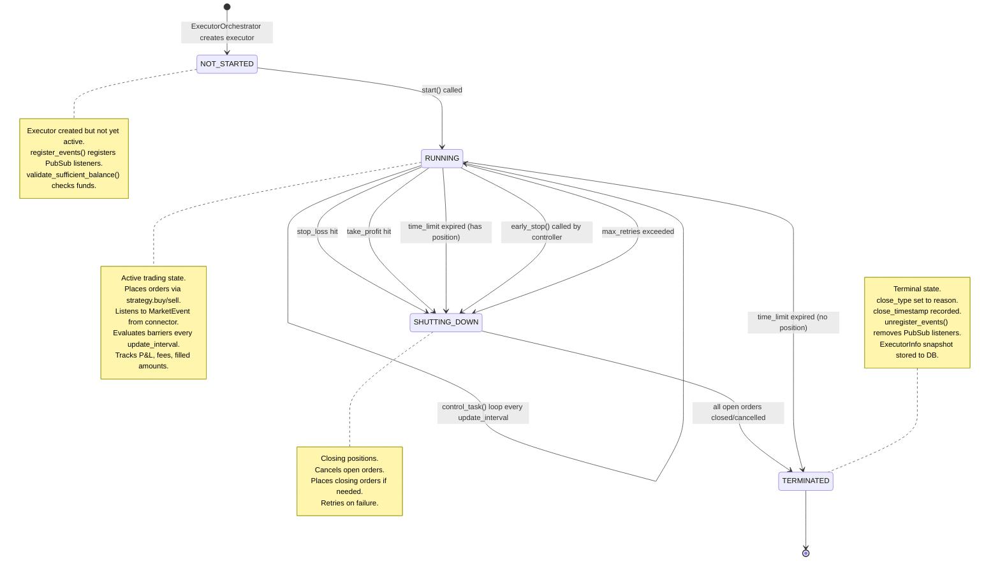
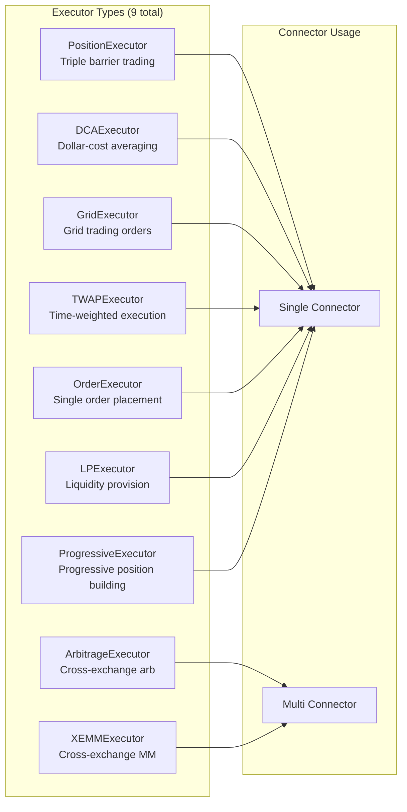

# Strategy V2 Dependency Graph -- Complete Component Visualization

This document provides a complete visual map of the Strategy V2 architecture: component
ownership, tick lifecycle, simulation seams, and executor state transitions. These diagrams
serve as the specification for understanding which components run unmodified in simulation
and which must be replaced.

## 1. Component Ownership Hierarchy

Every runtime object in the Strategy V2 stack has a clear owner. The Clock drives
`StrategyV2Base`, which owns the three top-level subsystems: market data, controllers,
and execution orchestration.

```mermaid
graph TD
    Clock["&#9200; Clock (tick driver)"] --> Strategy["&#128203; StrategyV2Base"]
    Strategy --> MDP["&#128202; MarketDataProvider"]
    Strategy --> Controllers["&#127919; ControllerBase x N"]
    Strategy --> Orchestrator["&#128295; ExecutorOrchestrator"]
    Strategy --> Queue["&#128236; actions_queue"]

    MDP --> Connectors["&#128268; ConnectorBase x N"]
    MDP --> CandlesFeeds["&#128200; CandlesFeeds x N"]
    MDP --> RateOracle["&#128177; RateOracle"]

    Controllers --> |reads| MDP
    Controllers --> |writes| Queue

    Orchestrator --> Executors["&#9889; ExecutorBase x M"]
    Executors --> |events from| Connectors
    Executors --> |orders via| Strategy

    Orchestrator --> DB["&#128190; MarketsRecorder"]

    style Connectors fill:#ff6b6b,color:#fff
    style CandlesFeeds fill:#ffd93d,color:#000
    style MDP fill:#6bcb77,color:#fff
    style DB fill:#4d96ff,color:#fff
    style RateOracle fill:#4d96ff,color:#fff
```



**Legend:**
| Color | Meaning | Examples |
|-------|---------|----------|
| RED | Live exchange dependency -- requires network/WebSocket | ConnectorBase (REST + WS to exchange) |
| YELLOW | Data feed dependency -- requires external data source | CandlesFeeds (historical + live candle data) |
| GREEN | Pure Python -- runs unmodified in simulation | MarketDataProvider (delegates to connectors) |
| BLUE | Persistence / utility -- replaceable with in-memory | MarketsRecorder (SQLite), RateOracle (price conversion) |

### Detailed Ownership

| Owner | Component | Lifetime | Creation Point |
|-------|-----------|----------|----------------|
| `Clock` | `StrategyV2Base` | App lifetime | `HummingbotApplication.start()` |
| `StrategyV2Base` | `MarketDataProvider` | `__init__` | `MarketDataProvider(connectors)` |
| `StrategyV2Base` | `ExecutorOrchestrator` | `__init__` | `ExecutorOrchestrator(strategy=self, ...)` |
| `StrategyV2Base` | `ControllerBase x N` | `initialize_controllers()` | `controller_class(config, market_data_provider, actions_queue)` |
| `StrategyV2Base` | `actions_queue` | `__init__` | `asyncio.Queue()` |
| `ExecutorOrchestrator` | `ExecutorBase x M` | `execute_action(CreateExecutorAction)` | `executor_class(strategy, connectors, config)` |
| `MarketDataProvider` | connector refs | borrowed | Passed from `StrategyV2Base.connectors` |
| `MarketDataProvider` | candle feed refs | `initialize_candles_feed()` | `CandlesFactory.get_candle(config)` |

## 2. Tick Lifecycle Sequence

Every second (default tick interval), the Clock calls `StrategyV2Base.tick()`. This
triggers the complete control loop: data refresh, controller decisions, executor
management.



### Key Method Calls per Component

**StrategyV2Base.tick():**
```
tick(timestamp) -> on_tick()
  -> update_executors_info()          # refresh executor reports for controllers
  -> update_controllers_configs()     # hot-reload configs if changed
  -> determine_executor_actions()     # synchronous path (deprecated, kept for compat)
  -> execute_action(action)           # route to orchestrator
```

**ControllerBase (async loop):**
```
control_task():
  -> await executors_update_event.wait()   # blocks until strategy sets reports
  -> update_processed_data()               # compute signals, features
  -> determine_executor_actions()          # CreateExecutorAction / StopExecutorAction
  -> actions_queue.put(actions)            # send to strategy
```

**ExecutorBase (async loop):**
```
control_task():
  -> get_price(connector, pair)            # poll current price
  -> check stop_loss / take_profit / time_limit / trailing_stop
  -> if barrier hit: early_stop()
  -> else: manage_position() (subclass-specific)
```

**ExecutorOrchestrator.execute_action():**
```
execute_action(action):
  -> if CreateExecutorAction:
       executor = _executor_mapping[type](strategy, connectors, config)
       executor.start()
  -> if StopExecutorAction:
       executor.early_stop()
  -> if UpdateExecutorAction:
       executor.update_live(data)
  -> if StoreExecutorAction:
       MarketsRecorder.store_executor(info)
```

## 3. Simulation Seam Map

The Strategy V2 architecture has a clean separation between pure Python logic and
external dependencies. Six seams exist where simulation components can replace live
infrastructure. The pure Python components (left) run unmodified; only the seam
boundaries (right) need simulation implementations.



### Seam Details

| Seam | What It Replaces | Simulation Component | Complexity |
|------|-----------------|---------------------|------------|
| **1. ConnectorBase** | REST + WebSocket to exchange | `SimulatedConnector` | HIGH -- must replicate full event semantics |
| **2. CandlesFactory** | Live candle WebSocket feeds | `ReplayableCandleFeed` | LOW -- hb-candles-feed already extracted |
| **3. MDP.time()** | `time.time()` | Simulated clock time | LOW -- single property override |
| **4. MarketsRecorder** | SQLite persistence | In-memory store or no-op | LOW -- optional for simulation |
| **5. RateOracle** | Live exchange rate fetching | Static rate injection | LOW -- hb-rate-oracle Phase 1 supports this |
| **6. Clock** | Real-time asyncio clock | Deterministic simulated clock | MEDIUM -- must drive tick + connector together |

### What Each Seam Must Provide

**Seam 1 (ConnectorBase) -- the critical path:**
- `buy(pair, amount, type, price)` -> `str` (client_order_id)
- `sell(pair, amount, type, price)` -> `str` (client_order_id)
- `cancel(pair, client_order_id)` -> `None`
- `get_price_by_type(pair, price_type)` -> `Decimal`
- `get_order_book(pair)` -> `OrderBook`
- `get_balance(currency)` / `get_available_balance(currency)` -> `Decimal`
- `trading_rules[pair]` -> `TradingRule`
- `budget_checker.adjust_candidates(candidates)` -> `List[OrderCandidate]`
- `_order_tracker.fetch_order(client_order_id)` -> `InFlightOrder`
- `add_listener(event_tag, listener)` / `remove_listener(event_tag, listener)`
- `trigger_event(event_tag, message)` -- emit `MarketEvent.*` events
- `ready` -> `bool`
- `name` -> `str`
- `trading_pairs` -> `List[str]`
- `quantize_order_price(pair, price)` / `quantize_order_amount(pair, amount)` -> `Decimal`

## 4. Executor Lifecycle State Machine

All 9 executor types follow the same lifecycle state machine defined in `RunnableBase`
and `ExecutorBase`. The states are defined in `RunnableStatus` enum.



### Close Types and Their Triggers

| CloseType | Trigger | Executor State |
|-----------|---------|---------------|
| `STOP_LOSS` | Price crosses stop-loss barrier | SHUTTING_DOWN -> TERMINATED |
| `TAKE_PROFIT` | Price crosses take-profit barrier | SHUTTING_DOWN -> TERMINATED |
| `TIME_LIMIT` | Time exceeds config.time_limit | TERMINATED (if no position) or SHUTTING_DOWN |
| `EARLY_STOP` | Controller calls `StopExecutorAction` | SHUTTING_DOWN -> TERMINATED |
| `TRAILING_STOP` | Trailing stop activates then triggers | SHUTTING_DOWN -> TERMINATED |
| `FAILED` | Balance insufficient or max_retries exceeded | TERMINATED |
| `EXPIRED` | Order never filled within time window | TERMINATED |
| `COMPLETED` | Strategy-specific completion condition | TERMINATED |

### Executor Type Registry

The `ExecutorOrchestrator._executor_mapping` maps config types to executor classes:



### Event Subscriptions Per Executor

All executors subscribe to the same 7 `MarketEvent` types via `ExecutorBase.register_events()`:

| MarketEvent | Event Data Class | Handler Method |
|-------------|-----------------|----------------|
| `BuyOrderCreated` (200) | `BuyOrderCreatedEvent` | `process_order_created_event` |
| `SellOrderCreated` (201) | `SellOrderCreatedEvent` | `process_order_created_event` |
| `OrderFilled` (107) | `OrderFilledEvent` | `process_order_filled_event` |
| `BuyOrderCompleted` (102) | `BuyOrderCompletedEvent` | `process_order_completed_event` |
| `SellOrderCompleted` (103) | `SellOrderCompletedEvent` | `process_order_completed_event` |
| `OrderCancelled` (106) | `OrderCancelledEvent` | `process_order_canceled_event` |
| `OrderFailure` (198) | `MarketOrderFailureEvent` | `process_order_failed_event` |

Each executor subclass overrides these handler methods to implement type-specific logic
(e.g., `PositionExecutor` tracks entry/exit fills for P&L; `DCAExecutor` tracks multiple
DCA level fills; `GridExecutor` manages grid level orders).

## 5. Cross-Reference: Component Dependencies

This matrix shows which components depend on which seams. A checkmark means the
component directly calls methods on that seam.

| Component | Seam 1 (Connector) | Seam 2 (Candles) | Seam 3 (Time) | Seam 4 (DB) | Seam 5 (Rates) | Seam 6 (Clock) |
|-----------|:-:|:-:|:-:|:-:|:-:|:-:|
| **StrategyV2Base** | YES (buy/sell/cancel, ready) | -- | -- | -- | -- | YES (tick) |
| **MarketDataProvider** | YES (price, balance, ready) | YES (candles_df) | YES (time()) | -- | YES (rates) | -- |
| **ControllerBase** | -- (via MDP only) | YES (via MDP) | YES (via MDP) | -- | YES (via MDP) | -- |
| **ExecutorOrchestrator** | -- | -- | -- | YES (store) | -- | -- |
| **ExecutorBase** | YES (all 6 sub-protocols) | -- | -- | -- | -- | -- |
| **PositionExecutor** | YES | -- | -- | -- | -- | -- |
| **DCAExecutor** | YES | -- | -- | -- | -- | -- |
| **ArbitrageExecutor** | YES (2 connectors) | -- | -- | -- | -- | -- |
| **XEMMExecutor** | YES (2 connectors) | -- | -- | -- | -- | -- |
| **GridExecutor** | YES | -- | -- | -- | -- | -- |
| **TWAPExecutor** | YES | -- | -- | -- | -- | -- |
| **OrderExecutor** | YES | -- | -- | -- | -- | -- |
| **LPExecutor** | YES | -- | -- | -- | -- | -- |
| **ProgressiveExecutor** | YES | -- | -- | -- | -- | -- |

**Key observation:** Controllers never touch connectors directly -- they go through
`MarketDataProvider`. Executors touch connectors directly and are the primary consumers
of Seam 1. This means `SimulatedConnector` must satisfy executor requirements first;
controller requirements are handled transitively through MDP.
