# Event System Analysis -- PubSub, Events, and Simulation Requirements

This document analyzes the complete event system that connects connectors to executors.
Understanding this system is critical for `SimulatedConnector` because executors depend
on receiving events in the exact sequence and with the exact data classes that real
exchanges produce.

## 1. Event Class Hierarchy

The event system is built on Cython-backed PubSub infrastructure with Python event
forwarders that route typed events to executor handler methods.

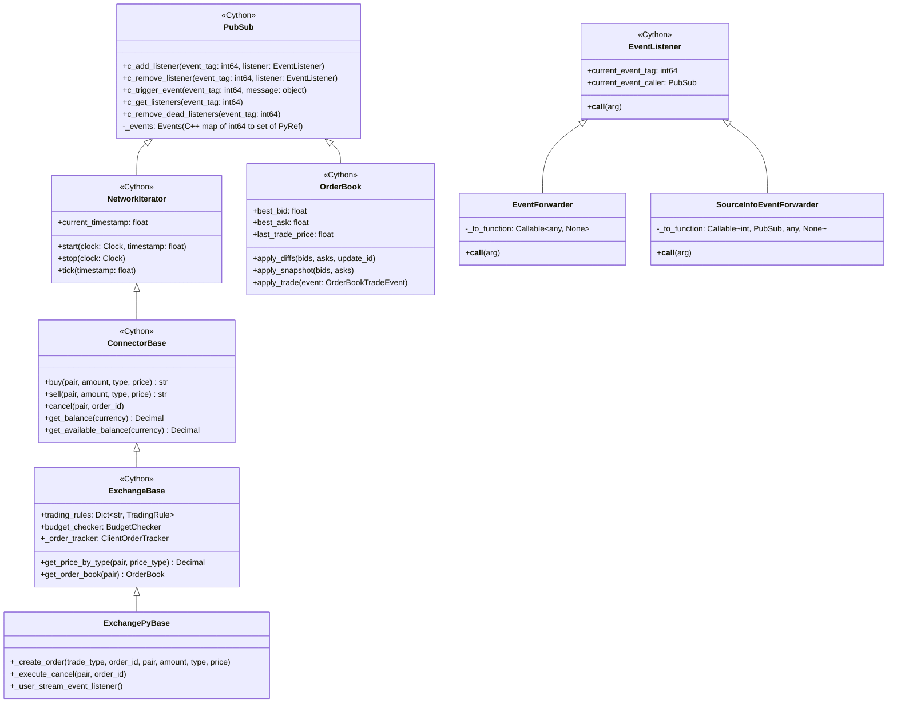

### Key Design Points

1. **PubSub is Cython** -- uses weak references to listeners and C++ maps for O(1) dispatch.
   SimulatedConnector needs a pure-Python compatible PubSub or must satisfy the same
   `add_listener`/`remove_listener`/`trigger_event` protocol.

2. **EventListener carries context** -- when `PubSub.c_trigger_event()` fires, it sets
   `listener.current_event_tag` and `listener.current_event_caller` before calling
   `listener.__call__(arg)`. This is how `SourceInfoEventForwarder` gets the event tag
   and source connector passed to the executor handler.

3. **ConnectorBase inherits PubSub** -- every connector IS a PubSub. Executors call
   `connector.add_listener(MarketEvent.OrderFilled, forwarder)` directly on the connector.

## 2. Event Flow: Connector to Executor

The complete chain from event emission to executor handler has three stages:
internal state update, PubSub dispatch, and forwarder routing.

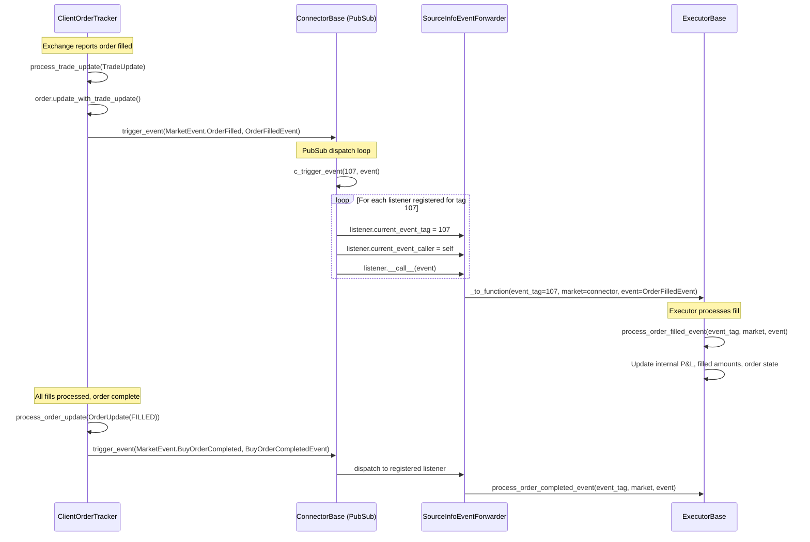

### Registration Flow

When an executor starts, it registers 7 event forwarders on each connector:

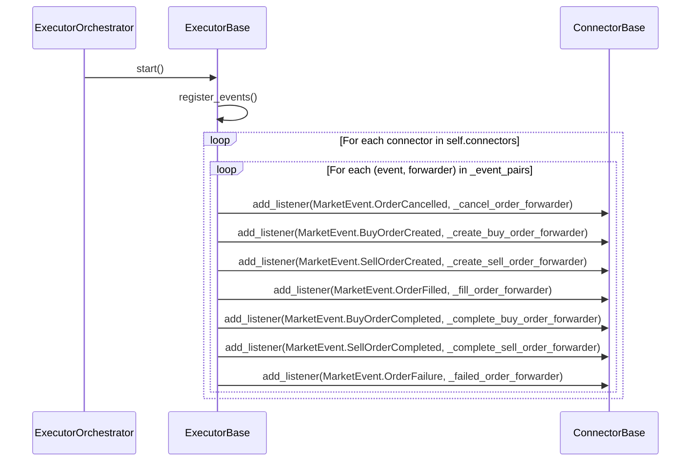

### Deregistration Flow

When an executor stops (terminal state), it unregisters all forwarders:

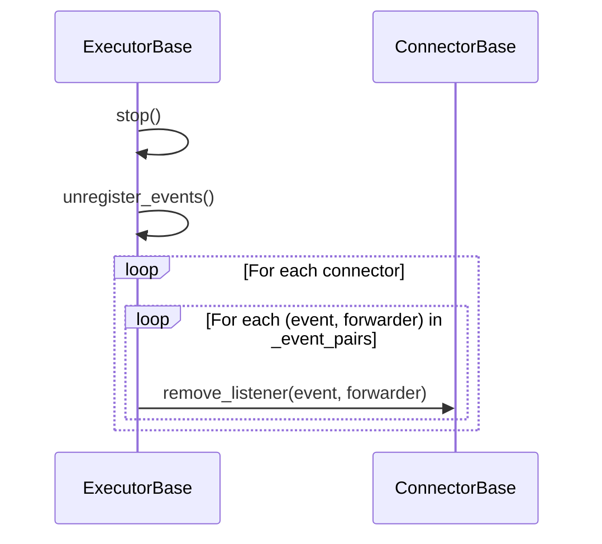

## 3. Complete MarketEvent Type Reference

All `MarketEvent` types, their integer tags, associated data classes, and executor
handler methods.

```mermaid
classDiagram
    class MarketEvent {
        <<enumeration>>
        ReceivedAsset = 101
        BuyOrderCompleted = 102
        SellOrderCompleted = 103
        WithdrawAsset = 105
        OrderCancelled = 106
        OrderFilled = 107
        OrderExpired = 108
        OrderUpdate = 109
        TradeUpdate = 110
        OrderFailure = 198
        TransactionFailure = 199
        BuyOrderCreated = 200
        SellOrderCreated = 201
        FundingPaymentCompleted = 202
        FundingInfo = 203
    }

    class BuyOrderCreatedEvent {
        +timestamp: float
        +order_type: OrderType
        +trading_pair: str
        +amount: Decimal
        +price: Decimal
        +order_id: str
        +creation_timestamp: float
        +exchange_order_id: str
        +leverage: int
        +position: str
    }

    class SellOrderCreatedEvent {
        +timestamp: float
        +order_type: OrderType
        +trading_pair: str
        +amount: Decimal
        +price: Decimal
        +order_id: str
        +creation_timestamp: float
        +exchange_order_id: str
        +leverage: int
        +position: str
    }

    class OrderFilledEvent {
        +timestamp: float
        +order_id: str
        +trading_pair: str
        +trade_type: TradeType
        +order_type: OrderType
        +price: Decimal
        +amount: Decimal
        +trade_fee: TradeFeeBase
        +exchange_trade_id: str
        +leverage: int
        +position: str
    }

    class BuyOrderCompletedEvent {
        +timestamp: float
        +order_id: str
        +base_asset: str
        +quote_asset: str
        +base_asset_amount: Decimal
        +quote_asset_amount: Decimal
        +order_type: OrderType
        +exchange_order_id: str
    }

    class SellOrderCompletedEvent {
        +timestamp: float
        +order_id: str
        +base_asset: str
        +quote_asset: str
        +base_asset_amount: Decimal
        +quote_asset_amount: Decimal
        +order_type: OrderType
        +exchange_order_id: str
    }

    class OrderCancelledEvent {
        +timestamp: float
        +order_id: str
        +exchange_order_id: str
    }

    class MarketOrderFailureEvent {
        +timestamp: float
        +order_id: str
        +order_type: OrderType
    }
```

### Event-to-Handler Mapping

| MarketEvent (tag) | Event Data Class | Executor Handler | Key Data Used by Executor |
|-------------------|-----------------|-----------------|---------------------------|
| `BuyOrderCreated` (200) | `BuyOrderCreatedEvent` | `process_order_created_event` | `order_id`, `timestamp`, `price`, `amount` |
| `SellOrderCreated` (201) | `SellOrderCreatedEvent` | `process_order_created_event` | `order_id`, `timestamp`, `price`, `amount` |
| `OrderFilled` (107) | `OrderFilledEvent` | `process_order_filled_event` | `order_id`, `price`, `amount`, `trade_fee`, `trade_type` |
| `BuyOrderCompleted` (102) | `BuyOrderCompletedEvent` | `process_order_completed_event` | `order_id`, `base_asset_amount`, `quote_asset_amount` |
| `SellOrderCompleted` (103) | `SellOrderCompletedEvent` | `process_order_completed_event` | `order_id`, `base_asset_amount`, `quote_asset_amount` |
| `OrderCancelled` (106) | `OrderCancelledEvent` | `process_order_canceled_event` | `order_id`, `timestamp` |
| `OrderFailure` (198) | `MarketOrderFailureEvent` | `process_order_failed_event` | `order_id`, `order_type` |

### Events NOT Used by ExecutorBase

These `MarketEvent` types exist but executors do not subscribe to them:

| MarketEvent | Used By | Notes |
|-------------|---------|-------|
| `ReceivedAsset` (101) | Legacy strategies | Not relevant to strategy_v2 |
| `WithdrawAsset` (105) | Legacy strategies | Not relevant to strategy_v2 |
| `OrderExpired` (108) | Not actively used | Could be useful for time-limited orders |
| `OrderUpdate` (109) | Internal tracker | ClientOrderTracker uses this internally |
| `TradeUpdate` (110) | Internal tracker | ClientOrderTracker uses this internally |
| `TransactionFailure` (199) | Gateway connectors | For blockchain transaction failures |
| `FundingPaymentCompleted` (202) | Perpetual MDP | MarketDataProvider tracks funding payments |
| `FundingInfo` (203) | Perpetual MDP | MarketDataProvider tracks funding rates |

## 4. Event Simulation Requirements

A `SimulatedConnector` must emit events in the exact sequence and with the exact data
classes shown below. The `ClientOrderTracker` handles most of this automatically when
driven by `TradeUpdate` and `OrderUpdate` objects, but the simulator must ensure correct
ordering.

### 4.1 Successful Market Order

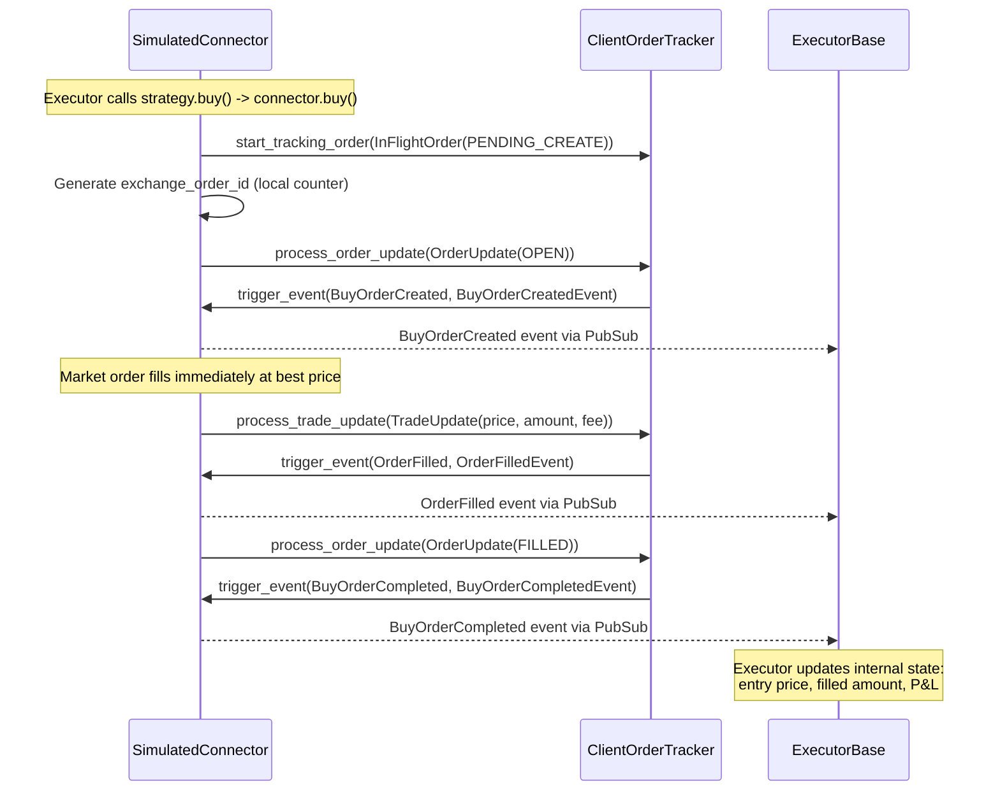

### 4.2 Successful Limit Order (Deferred Fill)

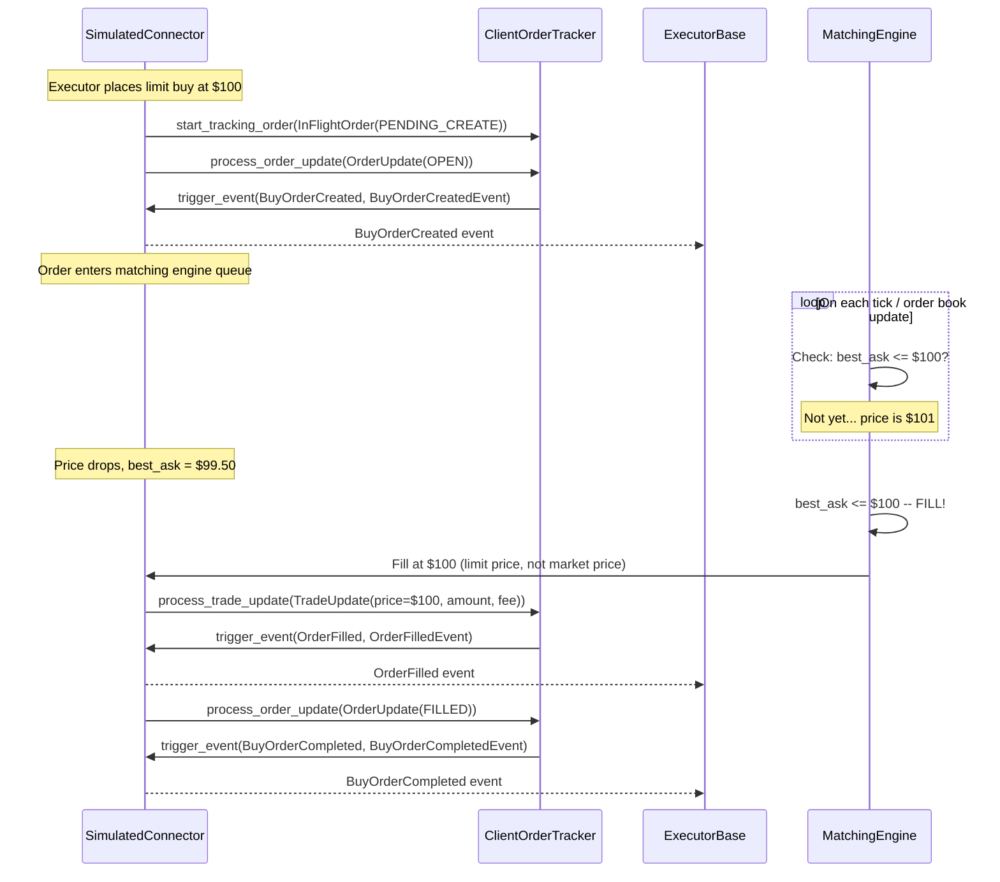

### 4.3 Partial Fill (Multiple Fills)

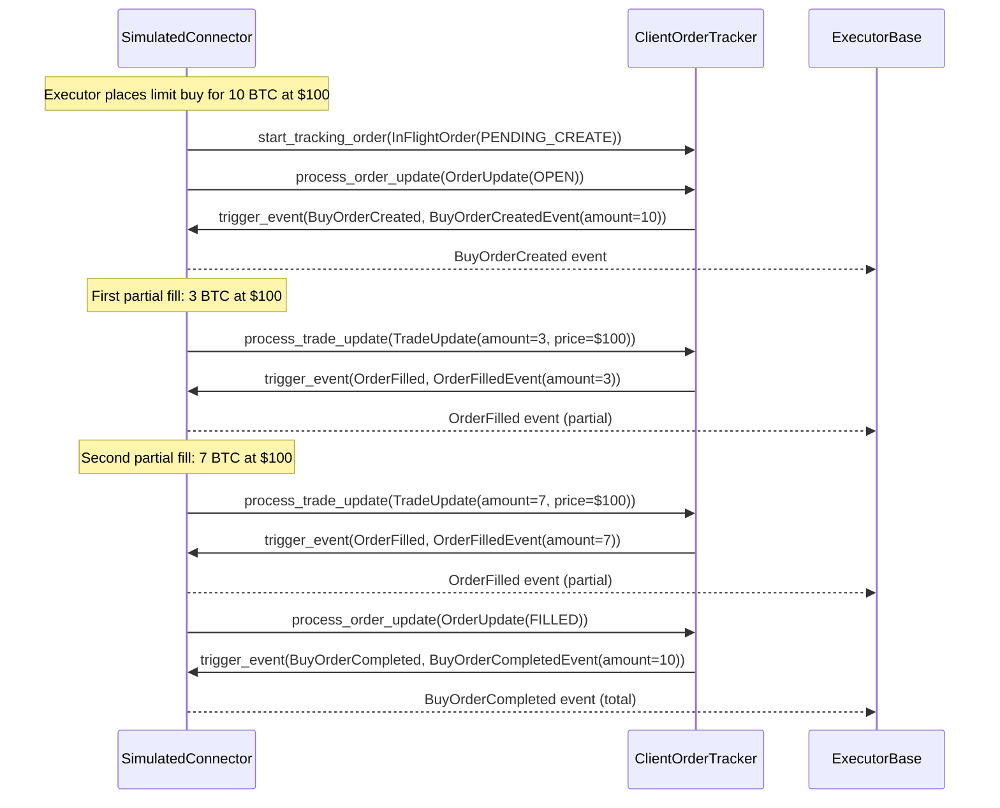

### 4.4 Order Cancellation

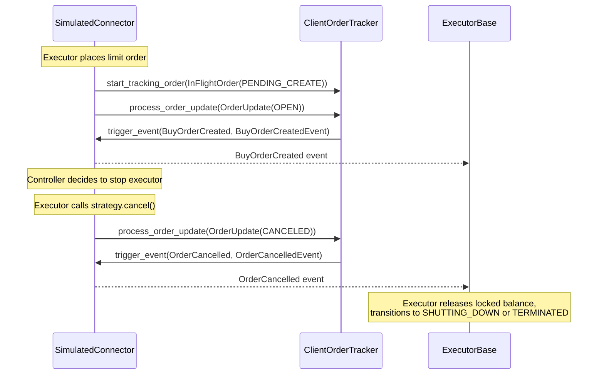

### 4.5 Order Failure

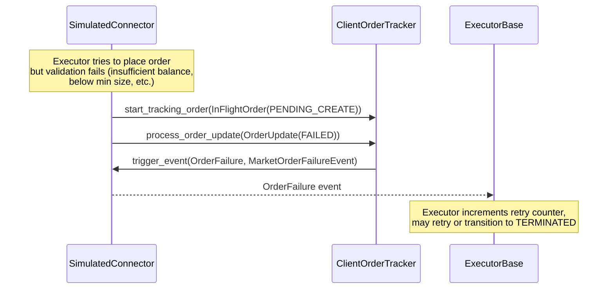

## 5. Critical Timing Constraint

The `ClientOrderTracker._process_order_update()` method has a critical timing
dependency: when it receives a `FILLED` state update, it waits up to **5 seconds**
for trade updates to arrive first:

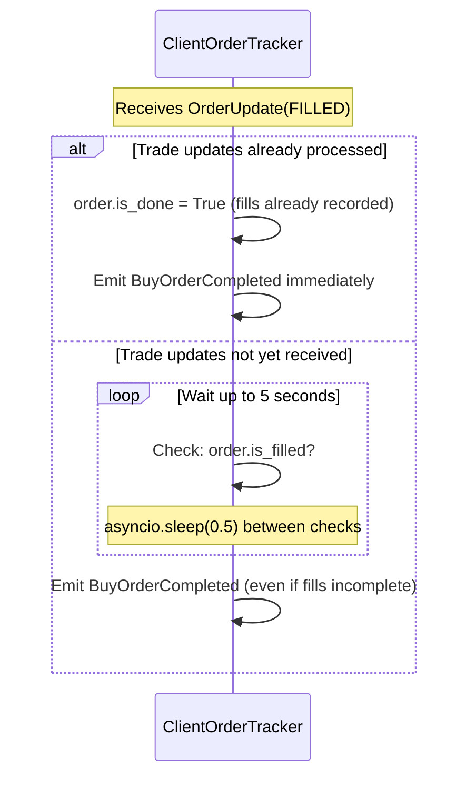

**Simulation requirement:** The `SimulatedConnector` must always process
`TradeUpdate` objects **before** the final `OrderUpdate(FILLED)`. This avoids the
5-second wait and ensures fills are recorded before the completion event.

Correct ordering:
1. `process_trade_update(...)` -- records the fill
2. `process_order_update(OrderUpdate(FILLED))` -- emits completion

Incorrect ordering (causes 5s delay):
1. `process_order_update(OrderUpdate(FILLED))` -- waits for fills
2. `process_trade_update(...)` -- arrives during the wait

## 6. PubSub Implementation for SimulatedConnector

The `SimulatedConnector` needs PubSub-compatible event dispatch. Two options:

### Option A: Extend ExchangePyBase (uses existing Cython PubSub)

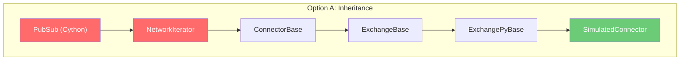

**Pros:** Full compatibility; `ClientOrderTracker` works unmodified.
**Cons:** Pulls in Cython dependencies, `NetworkIterator` lifecycle, network stubs.

### Option B: Protocol-Based (pure Python PubSub)

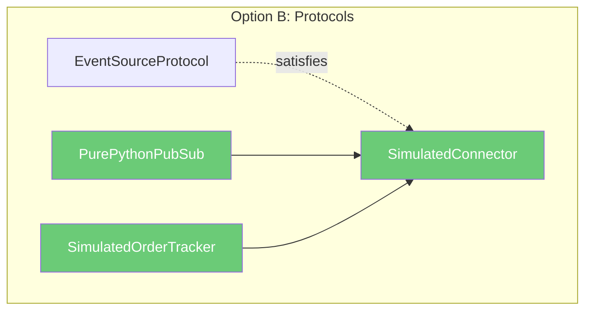

**Pros:** No Cython dependency; pure Python; standalone testable.
**Cons:** Must reimplement `ClientOrderTracker` event emission logic; must ensure
`SourceInfoEventForwarder` receives `current_event_tag` and `current_event_caller`.

### Recommended Approach

Start with **Option A** (extend `ExchangePyBase`) in the `hb_compat` layer. This
gets correct behavior immediately with minimal risk. In parallel, build a pure-Python
PubSub in `market_simulator/core/` for standalone testing. The `hb_compat` adapter
bridges the two worlds.

## 7. Event Filtering in Executors

A critical detail: multiple executors listen to the **same** connector's events
simultaneously. Each executor receives **all** events from its connectors, then
filters internally by checking the `order_id` against its own tracked orders.

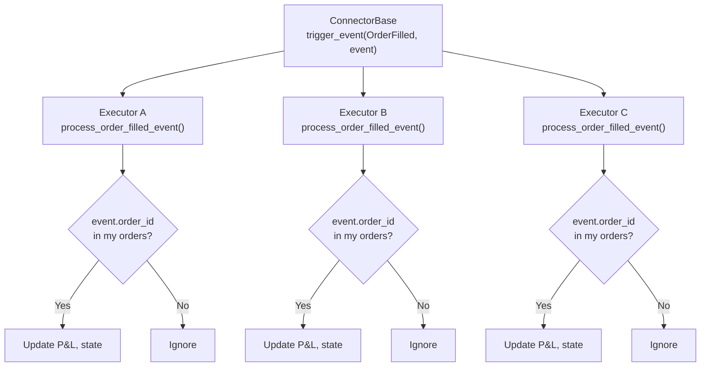

**Simulation implication:** The `SimulatedConnector` does not need to route events
to specific executors. It fires events on the PubSub; all registered listeners
receive them; each executor filters for its own orders. This is the same pattern
as production.
