# Hummingbot Architecture — Visual Guide

> One-page reference for reviewing the market-simulator plan and hummingbot re-architecture.

---

## 1. The Big Picture: What We're Building

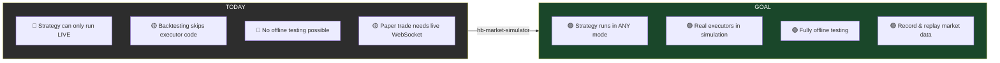

---

## 2. Current Architecture — Component Ownership

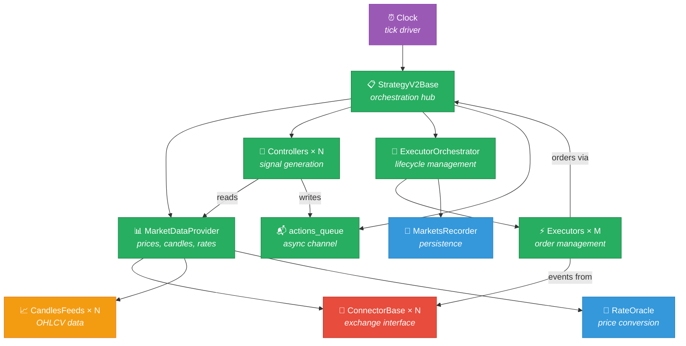

**Legend:**
- 🔴 **Red** = Live exchange dependency (must be simulated)
- 🟡 **Yellow** = Data feed dependency (can be replayed)
- 🔵 **Blue** = Utility/persistence (can be stubbed)
- 🟢 **Green** = Pure Python (runs unmodified in simulation)
- 🟣 **Purple** = Time driver (BacktestClock exists)

---

## 3. The Six Simulation Seams

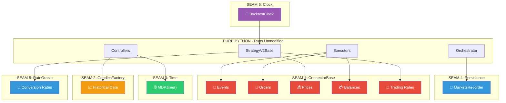

| Seam | Component | Simulation Strategy | Complexity |
|------|-----------|-------------------|------------|
| ① | ConnectorBase | SimulatedConnector with matching engine | 🔴 High |
| ② | CandlesFactory | Pre-loaded DataFrame injection | 🟢 Low |
| ③ | MDP.time() | Return simulated clock time | 🟢 Low |
| ④ | MarketsRecorder | In-memory or no-op | 🟢 Low |
| ⑤ | RateOracle | Static rate dict | 🟢 Low |
| ⑥ | Clock | BacktestClock (already exists!) | 🟢 Done |

---

## 4. ConnectorBase Protocol Decomposition

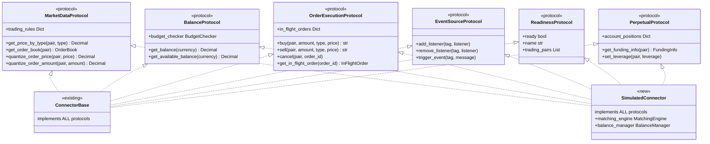

### Who Uses What?

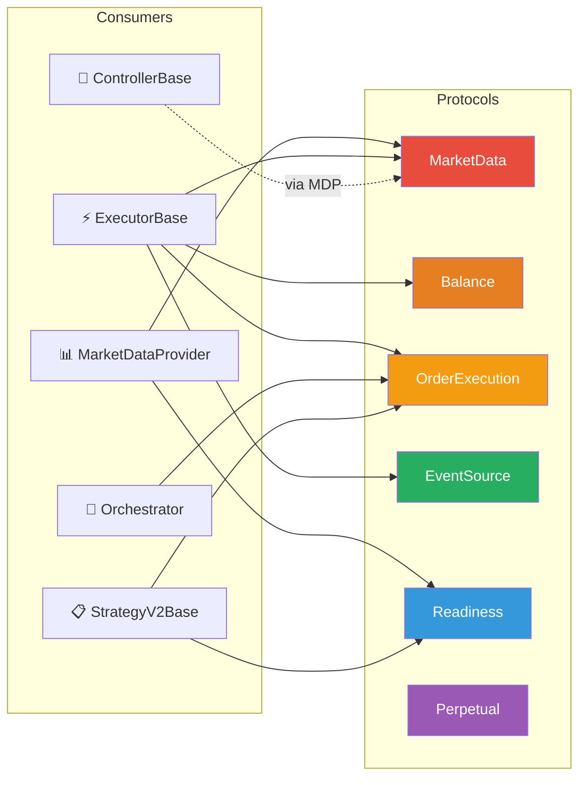

**Key Insight:** No single consumer needs ALL 6 protocols. ExecutorBase needs 4, MarketDataProvider needs 2, ControllerBase needs 0 directly (goes through MDP).

---

## 5. Data Flow: Exchange → Strategy

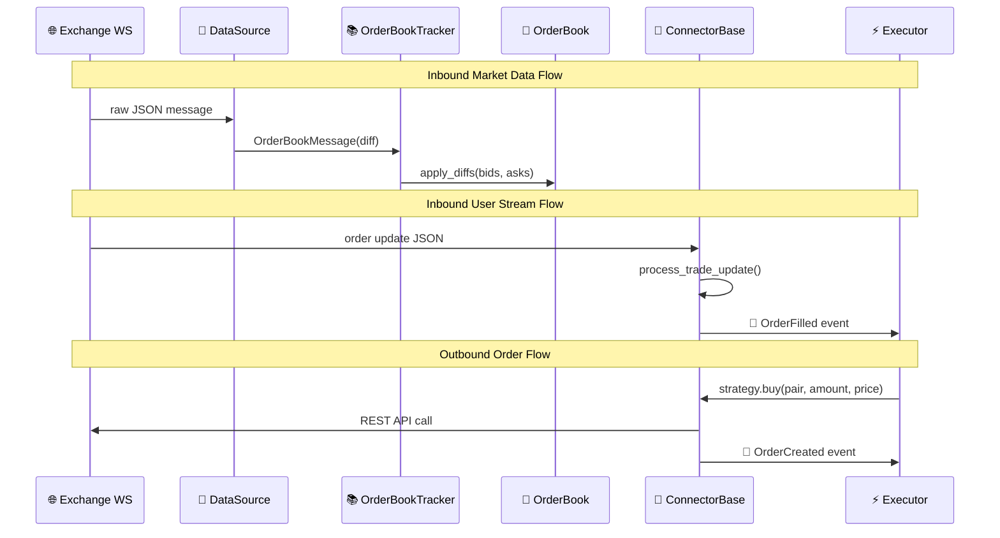

### What SimulatedConnector Replaces

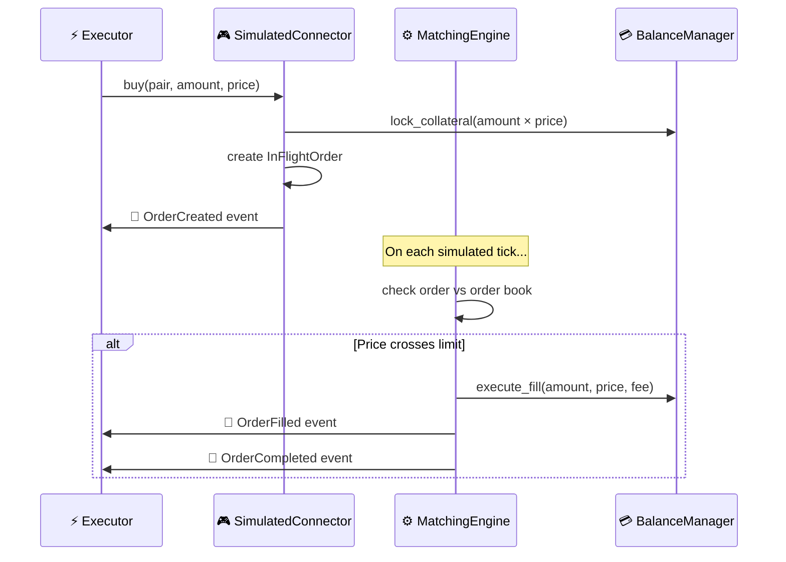

---

## 6. Executor Lifecycle State Machine

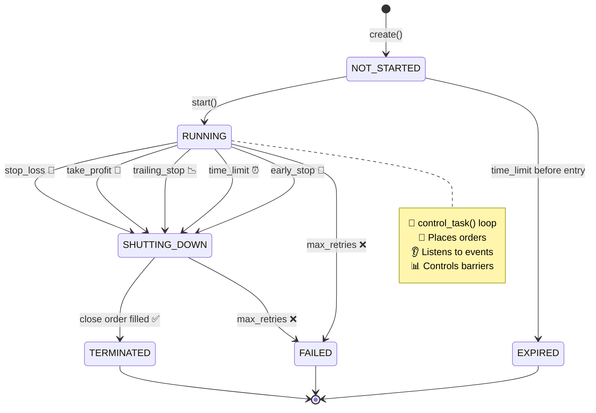

---

## 7. Current vs Proposed Backtesting

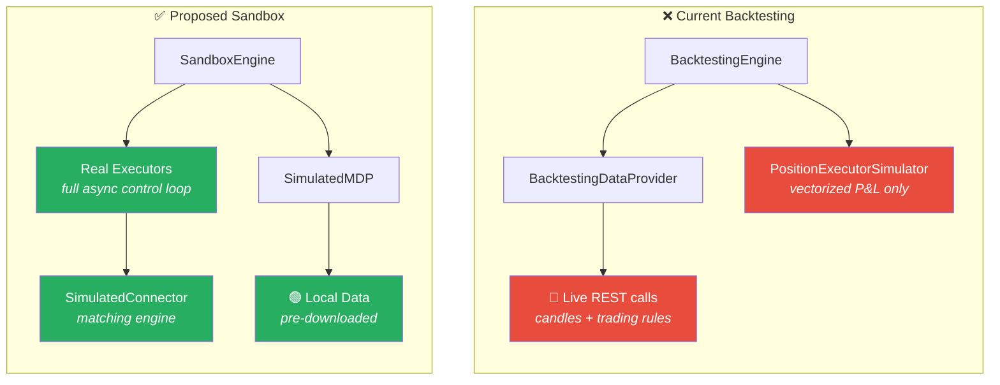

### Executor Coverage Comparison

| Executor | Current | Proposed | Gap |
|----------|:-------:|:--------:|:---:|
| PositionExecutor | 🟡 Vectorized | ✅ Full | P&L only → real state machine |
| DCAExecutor | 🟡 Maker only | ✅ Full | No taker support |
| GridExecutor | ❌ None | ✅ Full | Completely unsupported |
| TWAPExecutor | ❌ None | ✅ Full | Completely unsupported |
| XEMMExecutor | ❌ None | ✅ Full | Needs 2 connectors |
| ArbitrageExecutor | ❌ None | ✅ Full | Needs 2 connectors |
| ProgressiveExecutor | ❌ None | ✅ Full | Trailing stop logic untested |
| OrderExecutor | ❌ None | ✅ Full | Simple but unsupported |
| LPExecutor | ❌ None | ✅ Full | AMM-specific |

---

## 8. hb-market-simulator Package Architecture

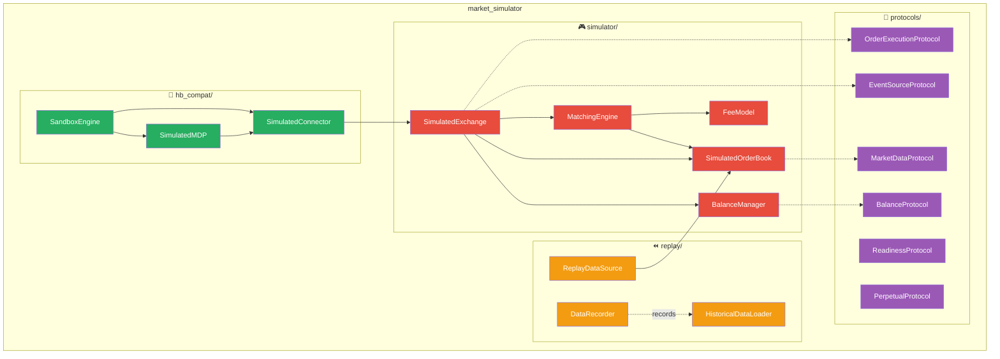

---

## 9. Implementation Phases

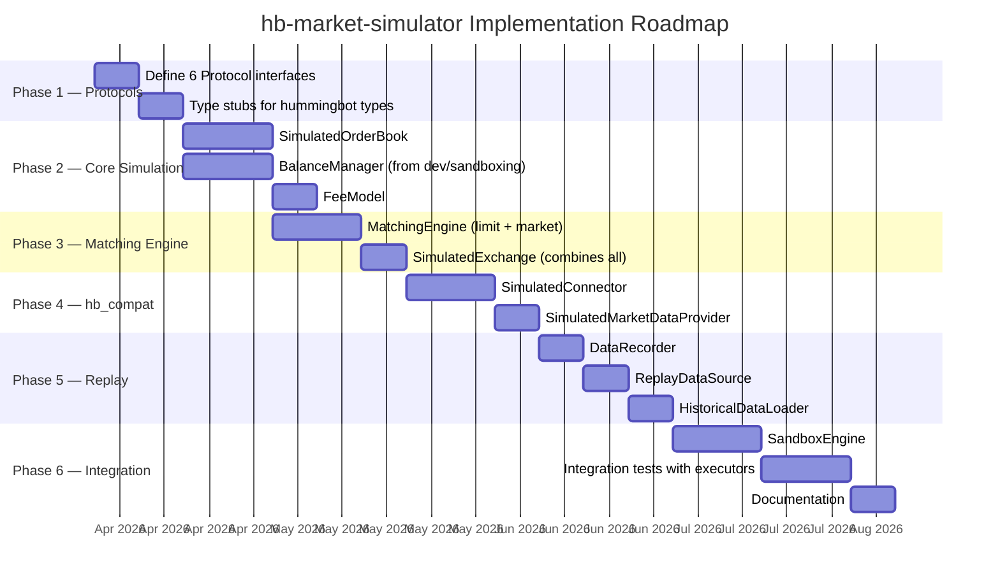

---

## 10. Sub-Package Extraction Roadmap

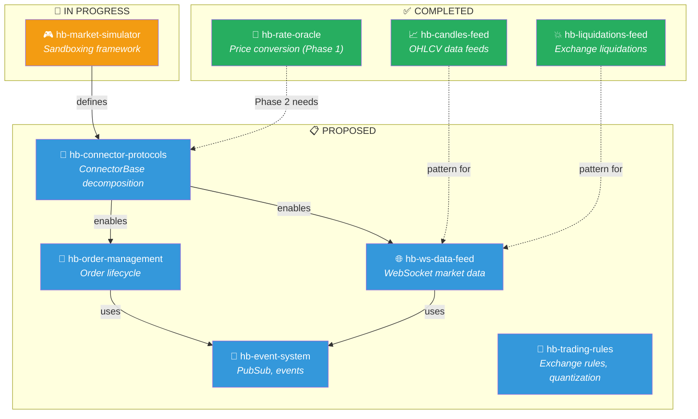

---

## 11. The Refactoring Journey

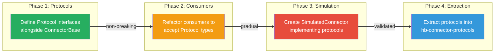

| Phase | Risk | Effort | Breaking Changes |
|-------|------|--------|-----------------|
| 1. Define Protocols | 🟢 None | 1 week | None — additive only |
| 2. Refactor Consumers | 🟡 Low | 2-3 weeks | Type hints only |
| 3. SimulatedConnector | 🟡 Medium | 3-4 weeks | None — new code |
| 4. Extract Package | 🟢 Low | 1 week | Import paths |

---

*This visual guide is auto-generated from the architecture analysis. See individual documents in `docs/architecture/` and `docs/proposals/` for full details.*
