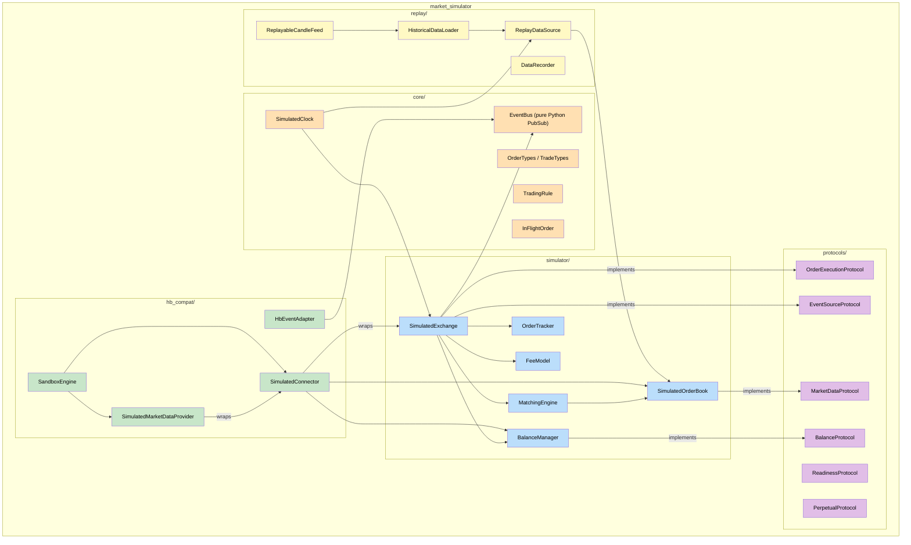
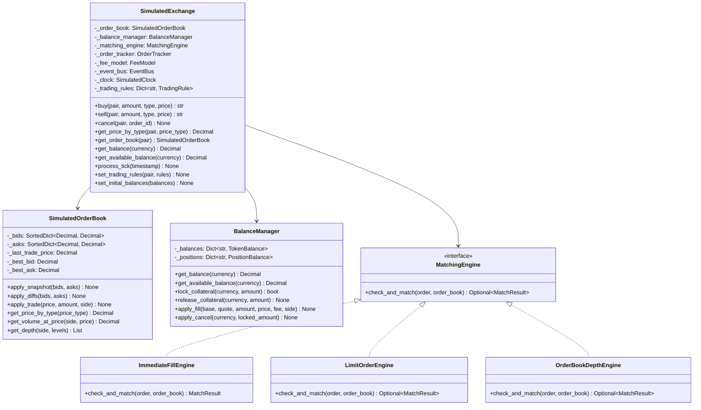
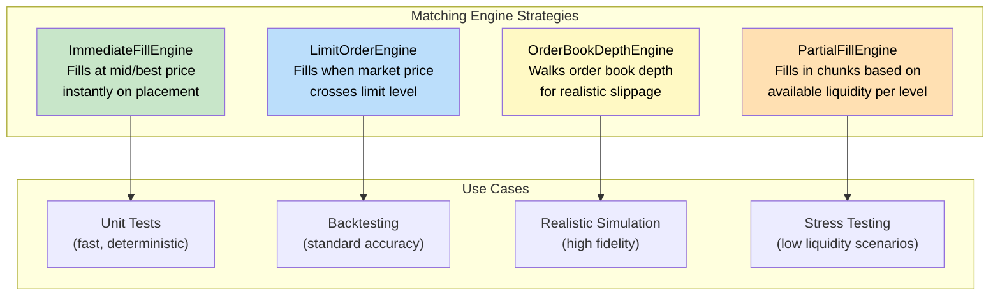
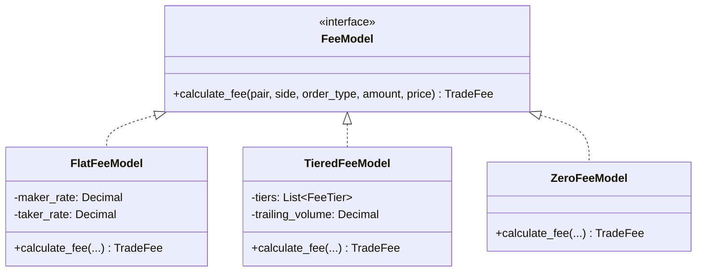
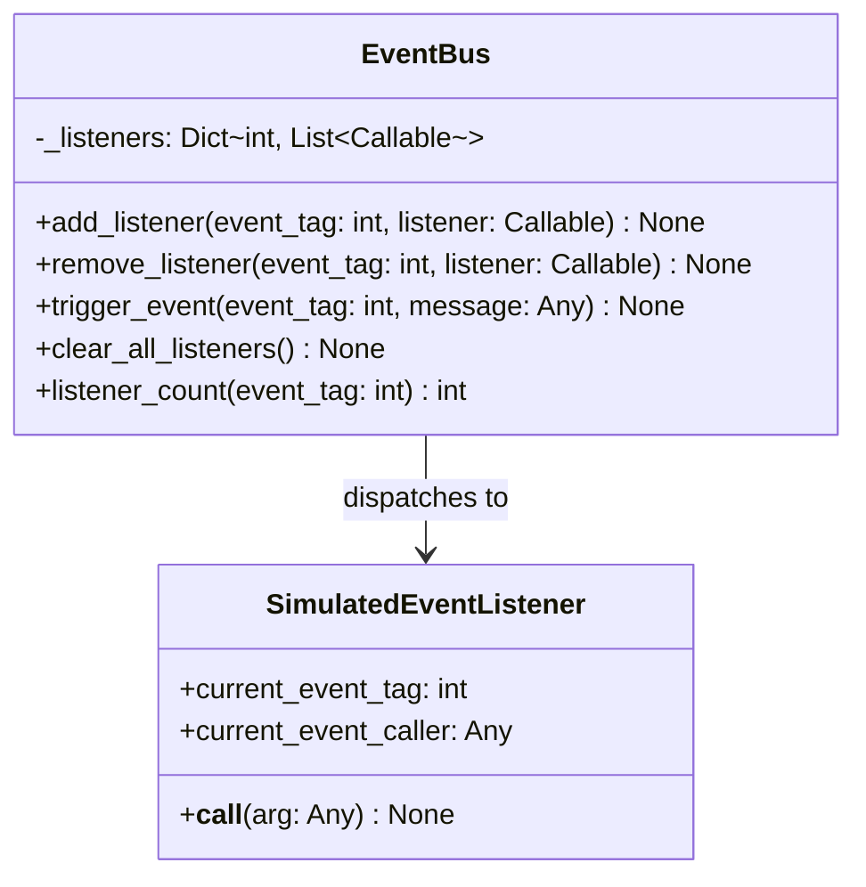
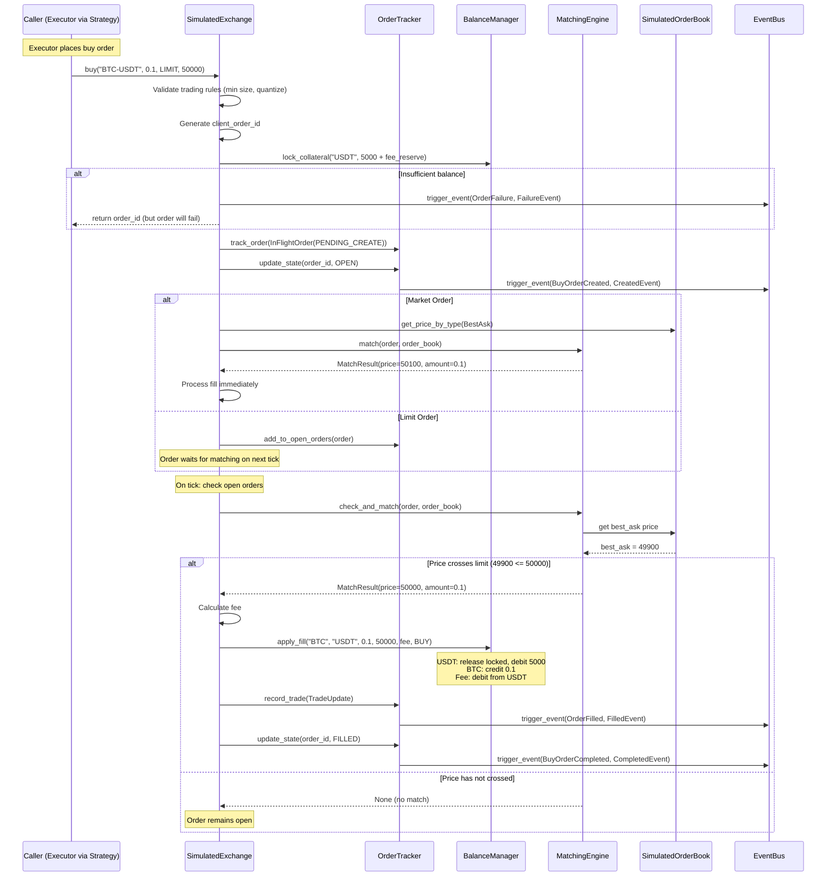
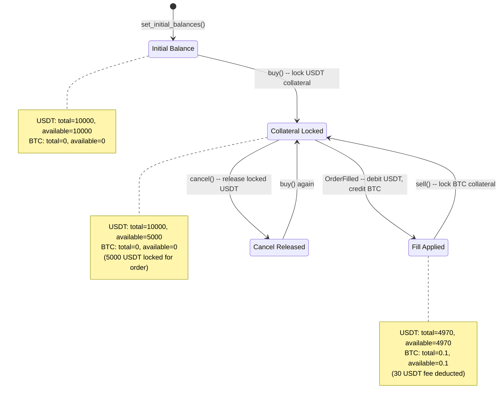
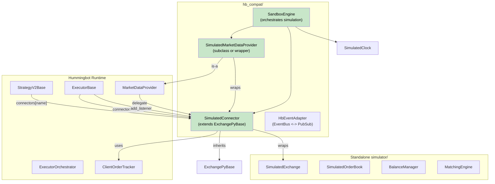
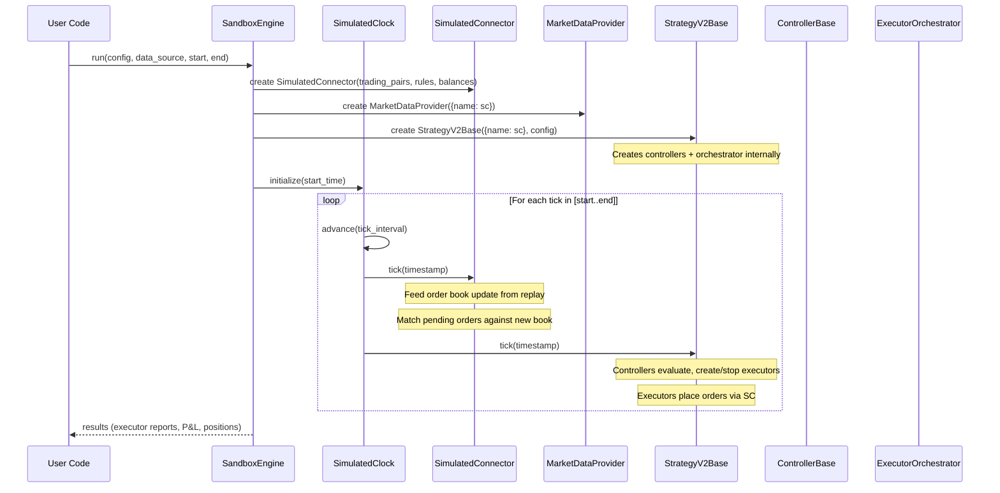
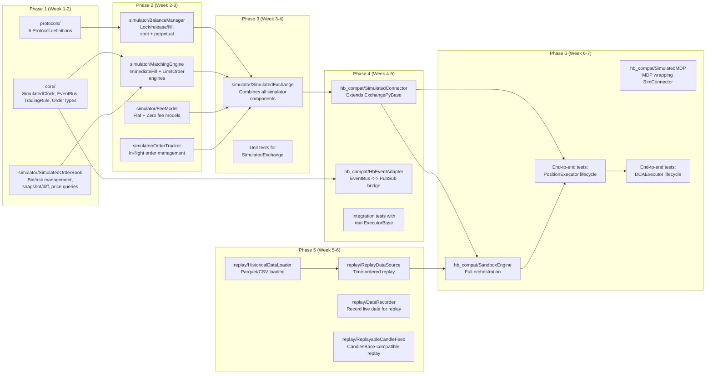

# hb-market-simulator Implementation Design

This document is the detailed implementation plan for the `market_simulator` sub-package.
It covers the package architecture, component interactions, data flow, and phased
build plan.

## 1. Package Architecture

The package is organized into five modules, each with a clear responsibility boundary.
Only `hb_compat/` imports from hummingbot; all other modules are standalone.



**Legend:**
| Color | Module | Dependency |
|-------|--------|-----------|
| Purple | `protocols/` | None (pure protocol definitions) |
| Orange | `core/` | None (standalone data types + utilities) |
| Blue | `simulator/` | `core/` and `protocols/` only |
| Yellow | `replay/` | `core/` only |
| Green | `hb_compat/` | `simulator/` + hummingbot imports |

### Module Responsibilities

| Module | Responsibility | Hummingbot Imports |
|--------|---------------|-------------------|
| `protocols/` | `@runtime_checkable` Protocol interfaces defining what a connector must provide | NONE |
| `core/` | Standalone data types: clock, order types, trading rules, pure-Python event bus | NONE |
| `simulator/` | Core simulation engine: exchange, order book, balance manager, matching engine | NONE |
| `replay/` | Historical data loading, recording, and replay | NONE |
| `hb_compat/` | Adapters that make simulator components work with hummingbot's runtime | YES (ConnectorBase, MarketEvent, etc.) |

## 2. Component Details

### 2.1 SimulatedExchange

The central component that coordinates order management, matching, balance tracking,
and event emission. It implements `OrderExecutionProtocol` and `EventSourceProtocol`.



### 2.2 MatchingEngine Strategies

The matching engine is pluggable, allowing different fill models for different testing needs.



| Engine | Fill Logic | Speed | Fidelity |
|--------|-----------|-------|----------|
| `ImmediateFillEngine` | Fill at mid price immediately on `buy()`/`sell()` | Fastest | Lowest -- no order book interaction |
| `LimitOrderEngine` | Fill when candle high/low crosses limit price | Fast | Medium -- respects limit prices, no depth |
| `OrderBookDepthEngine` | Walk order book levels, compute volume-weighted fill price | Medium | High -- realistic slippage modeling |
| `PartialFillEngine` | Fill available liquidity per tick, remainder stays open | Slowest | Highest -- realistic partial fills |

### 2.3 FeeModel



### 2.4 EventBus (Pure Python PubSub)

A lightweight, pure-Python replacement for hummingbot's Cython PubSub. Supports the
same `add_listener`/`remove_listener`/`trigger_event` interface.



In `hb_compat/`, the `HbEventAdapter` translates between the pure-Python `EventBus`
and hummingbot's Cython `PubSub` / `SourceInfoEventForwarder` system.

## 3. SimulatedExchange Order Flow

This sequence diagram shows the complete lifecycle of a simulated order, from
placement through matching to fill events and balance updates.



### Balance State Transitions



## 4. hb_compat Layer

The `hb_compat/` module bridges the standalone simulator with hummingbot's runtime.



### SimulatedConnector Strategy

The `SimulatedConnector` extends `ExchangePyBase` to inherit:
- `ClientOrderTracker` (handles order state machine and event emission)
- `BudgetChecker` (validates order sizes against available balance)
- Cython `PubSub` (event dispatch to executors)
- `NetworkIterator` lifecycle (clock integration)

It overrides the abstract methods that normally make REST API calls:
- `_place_order()` -- routes to `SimulatedExchange.buy/sell()` (synchronous)
- `_place_cancel()` -- routes to `SimulatedExchange.cancel()` (synchronous)
- `_update_balances()` -- reads from `BalanceManager` (no network)
- `_update_trading_rules()` -- returns pre-configured rules (no network)
- `_update_order_book()` -- fed by `ReplayDataSource` (no network)

This approach maximizes compatibility: the `ClientOrderTracker`'s event emission logic
runs unmodified, guaranteeing correct event sequences.

### SandboxEngine Orchestration



## 5. Implementation Phases



### Phase Deliverables

| Phase | Deliverable | Test Coverage | Dependencies |
|-------|------------|---------------|-------------|
| **1: Protocols + OrderBook** | Protocol defs, EventBus, SimulatedOrderBook, TradingRule | Unit tests for order book operations | None |
| **2: Balance + Matching** | BalanceManager, ImmediateFillEngine, LimitOrderEngine, FeeModel | Unit tests for balance lock/release/fill, matching logic | Phase 1 |
| **3: SimulatedExchange** | Combined exchange with order lifecycle | Integration tests for complete order flow | Phase 2 |
| **4: hb_compat Connector** | SimulatedConnector extending ExchangePyBase | Integration tests with real ExecutorBase event registration | Phase 3 |
| **5: Replay System** | HistoricalDataLoader, ReplayDataSource, DataRecorder | Unit tests for data loading and replay ordering | Phase 1 (core only) |
| **6: End-to-End** | SandboxEngine, full executor lifecycle tests | E2E: PositionExecutor + DCAExecutor full lifecycle | Phase 4 + 5 |

### Success Criteria Per Phase

**Phase 1 Complete When:**
- `SimulatedOrderBook` can apply snapshots, diffs, and return correct prices for all `PriceType` variants
- `EventBus` can register/deregister listeners and dispatch events
- All 6 protocols defined with `@runtime_checkable` decorators
- `isinstance(ConnectorBase_instance, MarketDataProtocol)` returns `True` (conformance check)

**Phase 2 Complete When:**
- `BalanceManager` correctly handles: initial deposit, lock on order, release on cancel, debit/credit on fill
- `BalanceManager` handles perpetual: margin lock, position open/close, realized PnL
- `ImmediateFillEngine` fills at best price for all order types
- `LimitOrderEngine` correctly identifies when limit price is crossed

**Phase 3 Complete When:**
- `SimulatedExchange.buy()` -> `OrderCreated` -> `OrderFilled` -> `OrderCompleted` event sequence verified
- `SimulatedExchange.cancel()` -> `OrderCancelled` event verified
- Balance correctly updated after fill (collateral released, assets exchanged)
- Multiple concurrent orders tracked independently

**Phase 4 Complete When:**
- `SimulatedConnector` passes `isinstance(sc, ExchangePyBase)` check
- `ExecutorBase` can `register_events()` on `SimulatedConnector`
- `ExecutorBase.place_order()` routes through `StrategyV2Base.buy()` to `SimulatedConnector`
- Events dispatched to executor correctly (verified via mock executor)

**Phase 5 Complete When:**
- `HistoricalDataLoader` loads Parquet files with OHLCV + trade data
- `ReplayDataSource` feeds data in timestamp order
- `DataRecorder` captures live order book + trade data to Parquet

**Phase 6 Complete When:**
- `PositionExecutor` completes full lifecycle: entry fill -> barrier evaluation -> exit fill -> TERMINATED
- `DCAExecutor` completes multi-level entry + exit lifecycle
- All events emitted in correct sequence (verified against production event logs)
- Balance tracking matches expected P&L calculations

## 6. Data Formats

### Historical Data (Parquet Schema)

**Order Book Snapshots:**
```
timestamp: int64 (epoch ms)
trading_pair: string
bids: list<struct<price: float64, amount: float64>>
asks: list<struct<price: float64, amount: float64>>
```

**Trades:**
```
timestamp: int64 (epoch ms)
trading_pair: string
trade_id: string
price: float64
amount: float64
side: string ("buy" | "sell")
```

**OHLCV Candles:**
```
timestamp: int64 (epoch ms)
open: float64
high: float64
low: float64
close: float64
volume: float64
```

### Recording Format

`DataRecorder` captures live data in the same Parquet schema, enabling:
1. Record a live trading session
2. Replay it offline for strategy tuning
3. Deterministic regression testing against known market conditions

## 7. Configuration

### SimulatedExchange Configuration

```python
@dataclass
class SimulatedExchangeConfig:
    """Configuration for a SimulatedExchange instance."""

    # Identity
    name: str = "simulated_exchange"
    trading_pairs: List[str] = field(default_factory=list)

    # Trading rules per pair
    trading_rules: Dict[str, TradingRuleConfig] = field(default_factory=dict)

    # Initial balances
    initial_balances: Dict[str, Decimal] = field(default_factory=dict)

    # Matching engine type
    matching_engine: str = "limit_order"  # "immediate", "limit_order", "order_book_depth"

    # Fee model
    fee_model: str = "flat"  # "flat", "tiered", "zero"
    maker_fee: Decimal = Decimal("0.001")
    taker_fee: Decimal = Decimal("0.001")

    # Perpetual-specific
    is_perpetual: bool = False
    default_leverage: int = 1
    funding_rate: Decimal = Decimal("0")
    funding_interval_hours: int = 8
```

### SandboxEngine Configuration

```python
@dataclass
class SandboxConfig:
    """Configuration for the SandboxEngine."""

    # Time range
    start_timestamp: int  # epoch seconds
    end_timestamp: int    # epoch seconds
    tick_interval: float = 1.0  # seconds between ticks

    # Exchanges (multiple for cross-exchange strategies)
    exchanges: List[SimulatedExchangeConfig] = field(default_factory=list)

    # Data sources
    data_dir: str = ""  # directory containing Parquet files

    # Controller config
    controller_config_path: str = ""  # YAML path

    # Replay mode
    replay_speed: float = 0.0  # 0 = as fast as possible, 1.0 = real-time
```
