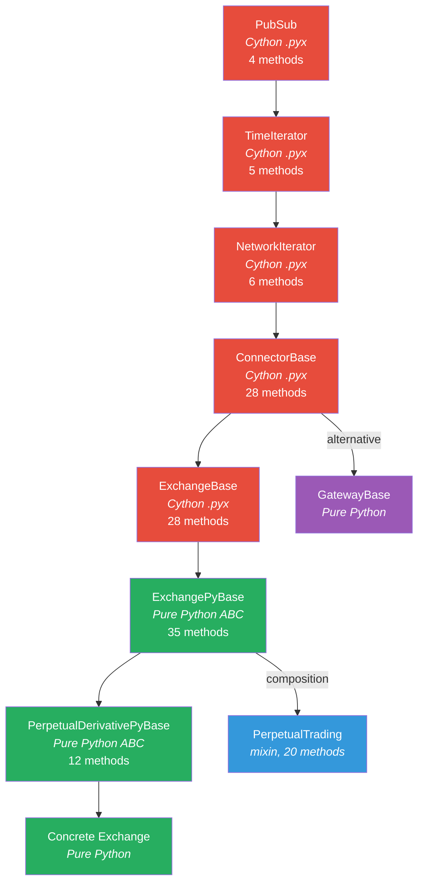
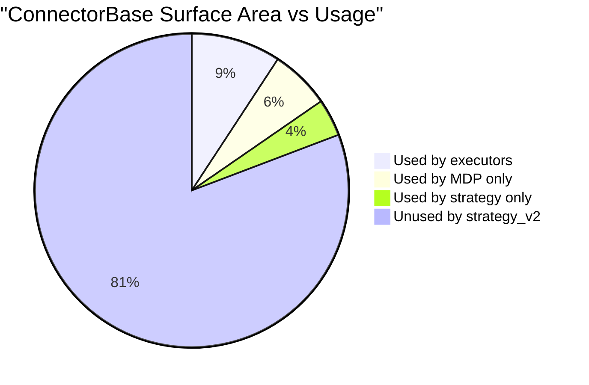
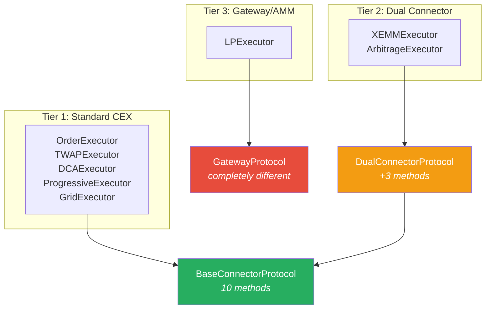
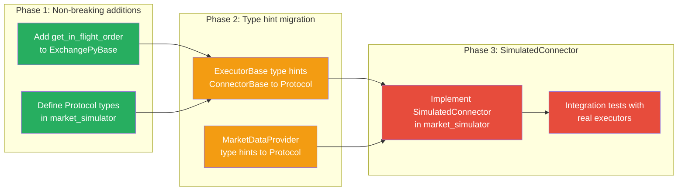

# Proposal: ConnectorBase Refactoring Assessment

> Based on deep analysis of the 7-layer inheritance chain and executor usage patterns.

---

## The Core Question: Does ConnectorBase Need Refactoring?

**Answer: Not immediately, but YES for simulation support.**

ConnectorBase itself doesn't need to change. What needs to happen:

1. **Define Protocol interfaces** that ConnectorBase already satisfies
2. **Surface private APIs** used by executors (`_order_tracker.fetch_order`)
3. **Create SimulatedConnector** implementing the same protocols
4. **Refactor executor type hints** to accept protocols instead of concrete types

ConnectorBase stays as-is. The Cython layers (PubSub → ExchangeBase) are performance-critical and should not be modified. The refactoring happens ABOVE ExchangePyBase.

---

## Inheritance Chain Analysis



**Red** = Cython (compiled, don't touch)
**Green** = Pure Python (refactorable)
**Blue** = Composition (good pattern)
**Purple** = Alternative path

---

## What Executors ACTUALLY Use (10-12 of 130+ methods)



### The Universal Base Protocol (all executors need this)

```python
class BaseConnectorProtocol(Protocol):
    # Price (from ExchangeBase)
    def get_price_by_type(self, pair: str, price_type: PriceType) -> Decimal: ...

    # Trading rules (from ExchangePyBase)
    @property
    def trading_rules(self) -> Dict[str, TradingRule]: ...

    # Balance (from ConnectorBase)
    def get_balance(self, currency: str) -> Decimal: ...
    def get_available_balance(self, currency: str) -> Decimal: ...

    # Budget (from ExchangeBase)
    @property
    def budget_checker(self) -> BudgetChecker: ...

    # Order tracking (NEEDS TO BE PUBLIC)
    def get_in_flight_order(self, client_order_id: str) -> Optional[InFlightOrder]: ...

    # Events (from PubSub)
    def add_listener(self, event_tag: int, listener: Any) -> None: ...
    def remove_listener(self, event_tag: int, listener: Any) -> None: ...

    # Readiness
    @property
    def ready(self) -> bool: ...
    @property
    def name(self) -> str: ...
```

---

## Three Executor Tiers



### Tier 1: Standard (7 executors)
Only needs `BaseConnectorProtocol`. Can be simulated with a single `SimulatedConnector`.

### Tier 2: Dual-Connector (2 executors)
Needs two connectors plus: `get_quote_price()`, `get_fee()`, `supported_order_types()`. Can be simulated with two `SimulatedConnector` instances.

### Tier 3: Gateway/AMM (1 executor - LPExecutor)
**Completely different interface.** Uses private Gateway APIs: `_clmm_add_liquidity`, `_clmm_close_position`, `get_pool_info_by_address`. Does NOT use buy/sell/cancel at all. **Out of scope for initial simulation** — requires a separate `SimulatedGateway`.

---

## The Three Refactoring Problems

### Problem 1: `_order_tracker` is private

Executors call `connector._order_tracker.fetch_order(client_order_id=...)`. This is a private attribute access.

**Fix:** Add a public method to ExchangePyBase:
```python
def get_in_flight_order(self, client_order_id: str) -> Optional[InFlightOrder]:
    return self._order_tracker.fetch_order(client_order_id=client_order_id)
```

**Risk:** None. Additive change, no breakage.

### Problem 2: strategy.buy() routing

Executors call `self._strategy.buy(connector_name, pair, amount, ...)` not `connector.buy(...)`. The strategy routes through `buy_with_specific_market()`.

**Fix for simulation:** The SimulatedConnector's `buy/sell/cancel` are called by a `SimulatedStrategy` wrapper that preserves the same routing pattern. No executor code changes needed.

### Problem 3: BudgetChecker

`BudgetChecker` is created by `ExchangeBase.__init__` with a reference to `self` (the connector). It calls connector methods internally.

**Fix:** `SimulatedConnector` creates its own `BudgetChecker(self)` — since `SimulatedConnector` implements the same methods, `BudgetChecker` works unchanged.

---

## Recommended Refactoring Path



| Phase | Breaking changes | Effort |
|-------|-----------------|--------|
| 1 | None | 1 day |
| 2 | Type hints only (runtime compatible) | 1 week |
| 3 | None (new code) | 2-3 weeks |

---

## What NOT to Refactor

1. **The Cython layers** — PubSub through ExchangeBase are performance-critical. Don't touch.
2. **The inheritance chain** — 31 spot + 15 perpetual connectors inherit this. Changing it breaks everything.
3. **ExchangePyBase lifecycle** — The polling loops, network management, order tracking are battle-tested. Don't replicate.
4. **The buy/sell routing** — strategy.buy() → connector.buy() routing exists for good reasons (multi-connector support, order tracking). Preserve it.

## What TO Refactor

1. **Add `get_in_flight_order()`** — Surface the private _order_tracker access
2. **Add `quantize_order_price/amount` to Protocol** — Already public, just needs Protocol definition
3. **Define Protocols alongside existing code** — No changes to ConnectorBase, just new Protocol classes
4. **Update type hints in executors** — `connector: ConnectorBase` → `connector: BaseConnectorProtocol`
